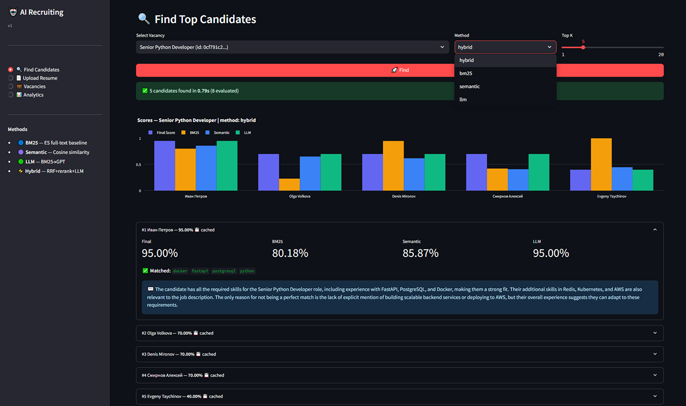
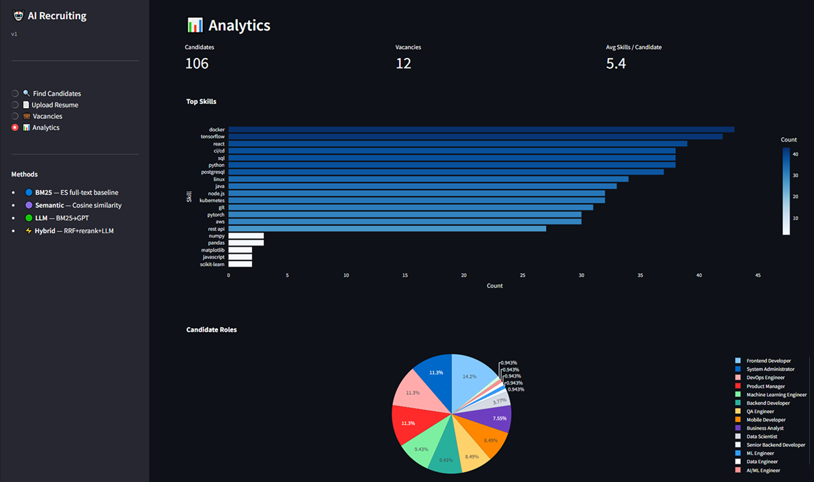
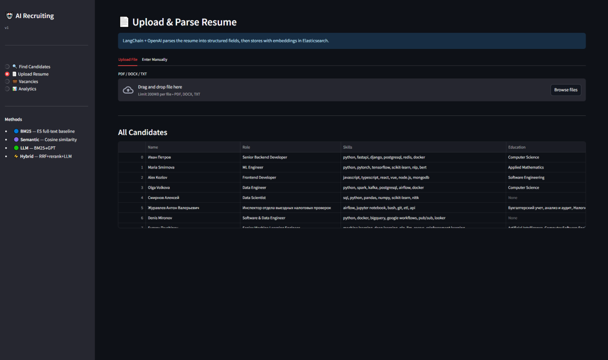

# 🤖 AI Recruitment System

An intelligent end-to-end recruitment automation system that leverages LLMs and vector search to streamline candidate sourcing, resume parsing, and matching. It automatically processes resumes from email inboxes, extracts structured data, and ranks candidates against job vacancies using a sophisticated hybrid matching pipeline.

---
## Find Top Candidates

## Analytics

## Manage Vacancies

## Upload Resume

---
## 🚀 Key Features

- **Automated Sourcing**: Monitors your email inbox (IMAP) to automatically download and process resume attachments.
- **Intelligent Parsing**: Converts unstructured resumes (PDF, DOCX, TXT) into structured JSON profiles using LLM-based extraction (e.g., **Llama 3 via Groq**).
- **Deep Search & Ranking**: Four distinct matching methods, ranging from fast keyword search to deep AI-driven analysis.
- **AI Recruiter Insights**: Provides a natural language explanation for every candidate's score, highlighting matched and missing skills.
- **OCR Integration**: Robust text extraction for scanned or image-based PDFs using Tesseract OCR.
- **Modern Dashboard**: A complete Streamlit web interface for managing vacancies, candidates, and viewing recommendations rankings.

---

## 🛠 Reliability & Performance

- **LLM Request Caching**: To minimize costs and latency, all scoring results for (Vacancy + Candidate) pairs are cached in Elasticsearch. Repeat requests for the same pairing are served instantly from the cache.
- **Smart Deduplication**: 
  - **Email Level**: The system tracks `Message-ID` headers to prevent re-processing the same email.
  - **File Level**: Every attachment is fingerprinted using `SHA-256`. Identical resume files are never processed twice, even if they arrive from different senders or emails.

---

## 🏗 System Architecture

The system is designed with a decoupled microservice-ready architecture, leveraging **FastAPI** for core logic and **Elasticsearch** as a unified storage and search engine.

### 🔄 Data Processing Pipeline

The journey from a raw email to a ranked candidate involves several critical stages:

1.  **Ingestion & Deduplication**:
    - The system periodically polls specified email folders via **IMAP**.
    - **Multiple Safeguards**: It checks the `Message-ID` to avoid re-scanning emails and computes a `SHA-256` hash of every attachment. Identical files are discarded immediately, ensuring the database remains clean.
2.  **Multi-Stage Text Extraction**:
    - **PDF Layer**: Attempts extraction using `pdfminer.six` (high fidelity) and `PyPDF2` (fallback).
    - **OCR Layer**: If a PDF is scanned or image-based, the system automatically triggers **Tesseract OCR** (via `pdf2image` and `pytesseract`) to recover text.
    - **Rich Formats**: Native support for `.docx` and `.txt`.
3.  **LLM Structured Parsing**:
    - Raw text is sent to the LLM (**Llama 3 / Groq** by default) with a strict Pydantic-validated schema.
    - Result: A clean JSON object containing `name`, `email`, `role`, `skills`, `education`, and a `summary`.
4.  **Vectorization & Indexing**:
    - The structured profile and raw text are converted into a **384-dimensional dense vector** using the `all-MiniLM-L6-v2` transformer model.
    - Everything is stored in Elasticsearch, indexed for both full-text (BM25) and vector (kNN) search.
5.  **Search Orchestration**:
    - When a user selects a vacancy, the system triggers the **Hybrid Pipeline** (BM25 + Semantic + RRF + LLM Scoring) to present the most relevant talent.

### Tech Stack

- **Backend**: FastAPI (Python 3.10+)
- **Frontend**: Streamlit
- **Database & Search**: Elasticsearch 8.x (Vector & Full-text)
- **LLM Engine**: Groq (Llama 3 / 70B)
- **Embeddings**: Sentence-Transformers (`all-MiniLM-L6-v2`)
- **OCR**: Tesseract OCR
- **Parsing**: LangChain + Pydantic
- **Infrastructure**: Docker & Docker Compose

---

## 🔍 Candidate Selection (Hybrid Pipeline)

The "Hybrid" method combines multiple retrieval and analysis strategies into a single high-precision pipeline:

| Method | Description |
| :--- | :--- |
| **BM25** | A fast, reliable baseline using Elasticsearch's internal BM25 algorithm to filter the pool based on exact keyword matches (skills, roles, titles). |
| **Semantic** | Finds candidates who are conceptually similar to the vacancy using **all-MiniLM-L6-v2** (Sentence-Transformers). Matches synonyms and context via **cosine similarity**. |
| **RRF** | **Reciprocal Rank Fusion** — mathematically merges the rankings from BM25 and Semantic search to produce a balanced, high-quality candidate list. |
| **Cosine Rerank** | Refines the ranking by performing a high-precision vector comparison between the vacancy and stored candidate embeddings. |
| **LLM Analysis** | Final stage where the LLM (**Llama 3-70B**) performs a granular analysis of the top-N candidates, providing a 0.0-1.0 score and detailed matching insights. |


---

## ⚙️ Getting Started

### Option 1: Docker Compose (all services in containers)

The easiest way — everything runs in Docker.

1.  **Configure Environment**:
    ```bash
    cp .env.example .env
    # Edit .env: 
    ```

2.  **Spin up the Stack**:
    ```bash
    docker compose up --build
    ```
    > This starts **Elasticsearch**, **FastAPI API**, and **Streamlit frontend** as containers.
    > All path variables (`ES_HOST`, `API_URL`, `DATA_DIR`, etc.) are set by docker-compose.yml.

3.  **Seed Initial Data** (Optional):
    ```bash
    docker compose exec api python scripts/seed_data.py
    ```

4.  **Access the Apps**:
    - **Web Dashboard**: [http://localhost:8501](http://localhost:8501)
    - **API Documentation**: [http://localhost:8000/docs](http://localhost:8000/docs)

---

### Option 2: Local development (only Elasticsearch in Docker)

Run the backend and frontend locally in your Python environment, with only Elasticsearch in Docker.

**Prerequisites**: Python 3.10+, Tesseract OCR (for scanned PDFs).

1.  **Start Elasticsearch in Docker**:
    ```bash
    docker compose up elasticsearch
    ```

2.  **Install Dependencies**:
    ```bash
    pip install -r requirements.txt
    ```

3.  **Configure `.env`**:
    ```bash
    cp .env.example .env
    # Edit .env
    # ES_HOST should be http://localhost:9200 (default)
    ```

4.  **Run Backend**:
    ```bash
    uvicorn app.main:app --reload
    # or
    python -m app.main
    ```

5.  **Run Frontend** (in another terminal):
    ```bash
    streamlit run streamlit_app.py
    ```

6.  **Seed Data** (Optional):
    ```bash
    python scripts/seed_data.py
    ```

7.  **Access the Apps**:
    - **Web Dashboard**: [http://localhost:8501](http://localhost:8501)
    - **API Documentation**: [http://localhost:8000/docs](http://localhost:8000/docs)
